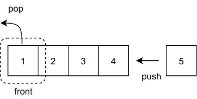
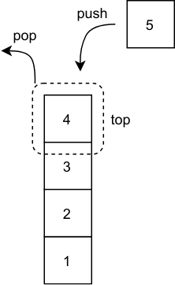

# テンプレート
```cpp
#include <bits/stdc++.h>
using namespace std;

int main(){
  
}
```
***
# 型

## string
以下、S, T を `string` 型の変数、c を `char` 型の変数とする。

| プログラム | 説明 | 
|:-----------|:------------|
| S[i]       | Sのi文字目。`char`型であることに注意   | 
| S += T (or c)     | `string`や`char`を連結可能      | 
| S.size()      | Sの長さを整数型で返す        |
| S.substr(i)         | Sの i 文字目から最後の文字までの部分文字列を返す          |
| S.substr(i , j)       | Sの i 文字目から i+j-1 文字目までの部分文字列を返す       |

## vector
`vector`は動的な配列を表す型。以下 a を`vector`型の変数、x を適当な変数または値とする。計算量は$` O(1) `$と高速。

| プログラム | 説明 | 
|:-----------|:------------|
| a.push_back(x)      | a の末尾に x を追加   | 
| a.pop_back(x)    | a の末尾の要素を除去    |
| a.size()    | a の要素数を返す    |


## pair
`pair`は2つの異なる型を1つの変数で持つことができる「組」を表現できる型。`pair<型1, 型2> p;`によって宣言可能。演算子による比較や`sort`によってソートできる。
以下、p を`pair`の変数とする。
  
| プログラム | 説明 | 
|:-----------|:------------|
| p.first      | 1つ目の値にアクセス   | 
| p.second    | 2つ目の値にアクセス    |
| make_pair(a , b)    |  (a , b)の`pair`の生成   |
| tie(a , b) = p   |  a に p.first が代入され、b に p.second が代入される   |

※`tie(a , ignore) = p`と`ignore`を引数に渡すことにより対応する位置の値を捨てることができる

## tuple
`tuple`は`pair`を一般化したもので、「複数個の値の組」を表す型である。`tuple<型1, 型2, ...> t;`によって宣言可能。演算子による比較や`sort`によってソートできる。
以下、t を`tuple`の変数とする。

| プログラム | 説明 | 
|:-----------|:------------|
| `get<i>(k)`      | i **（定数）** 番目にアクセス  |
| make_tuple(a , b, ...)    |  `tuple` の生成   |
| tie(a , b , ...) = t   |  t の分解   | 

※`tie`を使用する際、`ignore`を引数に渡すことにより対応する位置の値を捨てることができる。

## map
`map`は連想配列や辞書と呼ばれるデータ型。`map<Keyの型, Valueの型> m;`によって宣言可能。
以下、m を`map`の変数とする。

| プログラム | 説明 |  計算量 |
|:-----------|:------------|:------------|
| m[key] = value;| 値の追加・変更 | $` O(\log N) `$ |
| m.erase(key)      | key -> value の削除  |  $` O(\log N) `$ |
| m.at(key)      | valueへのアクセス  |  $` O(\log N) `$ |
| m.count(key)    |  Keyに対応するValueの存在判定。存在するなら`true`を返す   | $` O(\log N) `$ |
| m.size()   |  m の要素数を返す   | $` O(1) `$ |

以下、`map`のループの雛形。Keyの値が小さい順にループが回る。`auto`を用いると簡潔に記述できる。
```cpp
for (auto p : m) {
  auto key = p.first;
  auto value = p.second;
  // 操作
}
```
## queue
待ち行列のようなデータ構造を管理できる型。`queue<型> q;`によって宣言可能。
以下、q を`queue`の変数とする。



| プログラム | 説明 |  計算量 |
|:-----------|:------------|:------------|
| q.push(x)| q に要素 x を追加 | $` O(1) `$ |
| q.front()     | q の先頭の要素へアクセス  |  $` O(1) `$ |
| q.pop()      | q の先頭の要素を削除  |  $` O(1) `$ |
| q.size()    |  q の要素数の取得   | $` O(1) `$ |
| q.empty()   |  q が空なら`true`を返す   | ---- |

以下、`queue`のループの雛形。
```cpp
while (!q.empty()) {
  // 操作
  q.pop();  // 先頭の値を削除
}
```
## priority_queue
優先度付きキューというデータ構造。要素の大きい[小さい]順に取り出す処理を行うことが可能。
大きい順に取り出したいとき、`priority_queue<型> pq;`によって宣言可能。
以下、pq を`priority_queue`の変数とする。

| プログラム | 説明 |  計算量 |
|:-----------|:------------|:------------|
| pq.push(x)| pq に要素 x を追加 | $` O(\log N) `$ |
| pq.top()     | pq の最大の要素へアクセス  |  $` O(1) `$ |
| pq.pop()      | pq の最大の要素を削除  |  $` O(\log N) `$ |
| pq.size()    |  pq の要素数の取得   | $` O(1) `$ |
| pq.empty()   |  pq が空なら`true`を返す   | ---- |

小さい順に取り出したいとき、`priority_queue<型, vector<型>, greater<型>> pq;`と宣言すればよい。

## set
`set`は重複のないデータのまとまりを扱うためのデータ型。「Keyだけの`map`」のようなイメージ。`set<型> se;`によって宣言可能。

`set`は以下のような処理を行う場合などに有用。

* 配列の中に出現する値の種類数（重複の無い集合の要素数）
* 集合の中にある値が含まれるかを高速に計算する
* 集合の中に含まれる最小値（最大値）を求める

以下、se を`set`の変数とする。

| プログラム | 説明 |  計算量 |
|:-----------|:------------|:------------|
| se.insert(x)| se に要素 x を追加。※すでに同じ値が存在する場合、追加されない | $` O(\log N) `$ |
| se.erase(x)     | se から x を削除  |  $` O(\log N) `$|
| se.count(x)      | se に x が存在するなら 'true' |  $` O(\log N) `$ |
| se.size()    |  se の要素数の取得   | $` O(1) `$ |
| se.empty()   |  se が空なら`true`を返す   | ---- |
| *begin(se)   |  se の最小値の取得   | $` O(1) `$ |
| *rbegin(se)   |  se の最大値の取得   | $` O(1) `$ |

以下、`set`のループの雛形。ただし、値が小さい順に取り出される。
```cpp
for (auto value : se) {
  // valueを使って操作
}
```

## stack
「新しく追加したものほど先に取り出される」ような処理を行うデータ構造をスタックという。`stack<型> st;`によって宣言可能。ループは`queue`と同じようにすればできる。
以下、st を`stack`の変数とする。



| プログラム | 説明 |  計算量 |
|:-----------|:------------|:------------|
| st.push(x)| st に要素 x を追加 | $` O(1) `$ |
| st.top()     | st の頭の要素へアクセス  |  $` O(1) `$ |
| st.pop()      | st の頭の要素を削除  |  $` O(1) `$ |
| st.size()    |  st の要素数の取得   | $` O(1) `$ |
| st.empty()   |  st が空なら`true`を返す   | ---- |

## deque
「最初に追加したものを取り出す」というキューの操作と 「最後に追加した要素を取り出す」というスタックの操作を同時に行えるデータ構造を両端キューという。`deque<型> d;`によって宣言可能。
以下、d を`deque`の変数とする。

| プログラム | 説明 |  計算量 |
|:-----------|:------------|:------------|
| d.push_back(x)| d の末尾に要素 x を追加 | $` O(1) `$ |
| d.push_front(x)| d の先頭に要素 x を追加 | $` O(1) `$ |
| d.front()     | d の先頭の要素へアクセス  |  $` O(1) `$ |
| d.back()     | d の末尾の要素へアクセス  |  $` O(1) `$ |
| d.pop_front()      | d の先頭の要素を削除  |  $` O(1) `$ |
| d.pop_back()      | d の末尾の要素を削除  |  $` O(1) `$ |
| d.size()    |  d の要素数の取得   | $` O(1) `$ |
| d.empty()   |  d が空なら`true`を返す   | ---- |


# 以下覚えておくべき標準ライブラリ
## 絶対値 abs
`abs(x) = (x の絶対値)`となる。`cmath`をインクルードすることにより使える。

## 三角関数 sin/cos/tan
`x`は度数法ではなく弧度法を用いることに注意。`cmath`をインクルードすることにより使える。
```cpp
double pi = 3.141592653589793238;
double x;
cin >> x;

// 小数点以下10桁まで出力される
cout << fixed << setprecision(10);

//x度の時の値を出力
cout << sin(x / 180.0 * pi) << endl;
cout << cos(x / 180.0 * pi) << endl;
cout << tan(x / 180.0 * pi) << endl;
```

## 最小値・最大値 min/max
複数の値の、最小値・最大値を返す関数。以下、c は適当な型の配列。

| プログラム | 説明 |
|:-----------|:------------|
| min(a,b)       | 2 つの値 a, b のうち小さい方を返す        |
| max(a,b)    | 2 つの値 a, b のうち大きい方を返す    |
|  min({a1, a2, ..., an})      | {a1, a2, ..., an} の中で最小のものを返す        |
| max({a1, a2, ..., an})     |{a1, a2, ..., an} の中で最大のものを返す  |
| *min_element(c + l, c + r)       | {c[l], c[l+1], ..., c[r-1]} の中で最小のものを返す |
| *max_element(c + l, c + r)    | {c[l], c[l+1], ..., c[r-1]} の中で最大のものを返す|

なお、`min_element` 関数と `max_element` 関数はイテレーターを返すため、最初に * を付ける必要がある。`algorithm` をインクルードすることで使える。
```cpp
vector<int> c = { 1, 2, 3, 4, 5 };
int minx = 2147483647;

// 例 1： 配列 c の最小値を出力する方法 1 つ目
for (int i = 0; i < c.size(); i++) minx = min(minx, c.at(i));
cout << minx << endl;

// 例 2: 配列 c の最小値を出力する方法 2 つ目
cout << *min_element(c.begin() , c.end()) << endl;
```
## 値の交換 swap
`swap(a, b)` で、変数 a と b の値を入れ替えることができる。

## 最大公約数 __gcd
2 つの整数 a, b の最大公約数を返す関数。
`__gcd(a,b) = (a と b の最大公約数)`となる。計算量は$` O(\log a) `$のため高速。`algorithm` をインクルードすることで使える。

なお、a, bの最小公倍数は`__gcd(a,b) * b`によって求まる
> [!CAUTION]
> **この関数は gcc で利用可能だが、Visual Studio 2019 などでは使えない。**

関数が使えない場合のgcdの関数を以下に記す。
```cpp
int gcd(int a, int b) // a > b
{
  if(b == 0) return a;
  return gcd(b, a % b);
}
```

## 配列の合計 reduce
`int`や`double`の配列の合計値算出に対応する。`reduce(配列変数.begin(),配列変数.end())`で配列の合計値を返す。
```cpp
vector<int> c = { 1, 2, 3, 4, 5 };

// 配列cの合計を求める
cout << reduce(c.begin(), c.end()) << endl;
```

## 配列を逆順に並び替え reverse
配列 c のある区間を逆順に並び替える。

| プログラム | 説明 | 
|:-----------|:------------|
| reverse(c.begin(), c.end())      | cを逆順にすべて並び替える   | 
| reverse(c.begin() + i, c.begin() + j)    | c の i 番目から j 番目までを逆順に並び替える    | 

```cpp
vector<int> b = {8, 3, 7, 1, 4, 6, 2, 5};

// 例 1: 配列 a の 1～6 番目の要素を逆順にします。{8, 6, 4, 1, 7, 3, 2, 5} に変化します。
reverse(b.begin() + 1, b.end() -2);
for (int i = 0; i < b.size(); i++) cout << b[i] << " ";
cout << endl;
```

## ソート sort
`sort(c.begin(), c.end())`によって配列を小さい順に並び変える。文字列は辞書順に並び替える。C++の順序では`'0'`～`'9'`→`'A'`～`'Z'`→`'a'`～`'z'`である。`algorithm` をインクルードすることで使える。計算量は$` O(N\log N) `$。
```cpp
// 配列cを小さい順に並び替える。c = {1, 2, 3, 4, 5, 6, 7, 8} となる
vector<int> c = {8, 3, 7, 1, 4, 6, 2, 5};
sort(c.begin(), c.end());
for (int i = 0; i < c.size(); i++) cout << c[i] << " ";
cout << endl;

// 配列sを辞書順に並び替える。c = {"America", "Canada", "France", "Japan"} となる
vector<string> s = {"Japan","Canada","France","America"};
sort(s.begin(), s.end());
for (int i = 0; i < s.size(); i++) cout << s[i] << " ";
cout << endl;
```

## 型変換 to_string、stoi、stoll、stod
以下、文字列は`char`ではなく`string`である。
| プログラム | 説明 | 
|:-----------|:------------|
| to_string(x)      | 数値型から文字列に変換し、文字列を返す  | 
| stoi(x)    | 文字列から`int`に変換し、`int`を返す    |
| stoll()    | 文字列から`int64_t`に変換し、`int64_t`を返す   |
| stod(a)    | 文字列から`double`に変換し、`double`を返す   |

## 要素の個数 count
配列や`vector`のある区間の要素の中で、x がいくつ含まれるかを返す関数。
`count(v.begin(), v.end(), x)` によって配列 v の中で x となるようなものの個数を返す。

## 順列全探索 next_premutation
以下、vectorの配列 v に対する「順列全探索」の雛形。なお、事前に`sort`が必要なことに注意。
```cpp
sort(v.begin(), v.end());
do {
  // 順列に対する処理
} while (next_permutation(v.begin(), v.end()));
```

## 「値」以上[を超える]の最小の値 lower_bound、upper_bound
以下、v は `vector`の配列
| プログラム | 説明 | 
|:-----------|:------------|
| *lower_bound(v.begin(), v.end(), x)      | 「x」以上の最小の値を返す  | 
| *upper_bound(v.begin(), v.end(), x)    | 「x」を超える最小の値を返す    |


